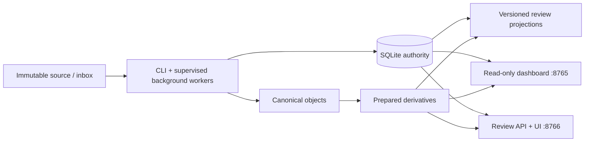

# Immutable Media Vault

Immutable Media Vault is a local-first Python application for discovering photos and videos in a read-only source, preserving every distinct byte sequence in a content-addressed vault, and reviewing/organizing the collection through prepared metadata and derivatives. Exact-file deduplication, visual relationships, RAW/JPEG grouping, import decisions, favourites, ratings, rejection, Stacks, and junk suggestions are represented as persisted evidence or metadata—never as destructive edits to source or canonical media.

> [!CAUTION]
> **Current status: preserved WIP, not a live-vault release.** Do not run the review UI, worker, inbox scan, backfill launcher, legacy import/analyze/validate, or migration against `G:\photos`, `G:\MediaVault`, or `G:\MediaVaultImports`. The 2026-07-22 full review found release-critical writer-lock, path-containment, canonical-publication, job-recovery, workflow, and disaster-recovery defects. Read [the safety hold](docs/SAFETY_HOLD.md) before doing anything with real data.

The reviewed WIP is preserved on `codex/wip-review-interface-audit`. Passing synthetic tests are useful evidence, not production approval.

## Project principles

- Source media and published canonical objects are permanently immutable.
- No operation automatically deletes, moves, renames, overwrites, or rewrites media.
- Reject, favourite, rate, exclude, Stack, junk, and similar actions update application metadata only.
- Exact byte identity is distinct from decoded-pixel, perceptual, stream, or contextual similarity.
- Derivatives, caches, materializations, and map clusters remain separate and regenerable.
- HTTP requests may query persisted data, serve existing derivatives, update metadata, or enqueue work; media work belongs in background processes.
- The review application is separate from the existing read-only dashboard.
- Tests use isolated synthetic corpora and keep screenshots, video, and traces disabled.
- Schema migration and exclusive maintenance must refuse to run while any live writer exists.

## Capability and readiness

| Surface | Intended capability | Reviewed state |
|---|---|---|
| Legacy CLI | Initialize, scan/preflight, verified import, analyze, validate, export, rebuild reduced index | Substantial implementation; **live mutation held** because storage/path/source-read/writer defects cross these flows |
| Legacy dashboard (`:8765`) | Read-only status, assets, sources, relationships, and prepared previews | HTTP and SQLite are read-only, but hostname/DNS-rebinding and path-boundary flaws mean **copied/synthetic state only while held** |
| Review application (`:8766`) | Inbox review, approval/copy, Library, Organize, Stacks, junk review, bulk metadata actions, Settings | Broad WIP prototype; **live use held** because confirmations, jobs, backfill scope, downstream preparation, caching, paging, and recovery are incomplete |
| Background preprocessing | Persist derivatives, metadata, features, previews, and projections outside HTTP requests | Implemented and tested synthetically; lease/recovery, decoder bounds, checksum trust, resource limits, and orchestration need rework |
| Backup/recovery | Migration backup, records/exports, reduced `rebuild-index` | Not complete disaster recovery; use the manual remote-backup runbook and prove an isolated restore |

The complete ordered roadmap is [docs/ACTION_PRIORITY_MATRIX.md](docs/ACTION_PRIORITY_MATRIX.md). It ranks all 58 actions overall and separately by safety, ease of use, reliability, security/privacy, scalability, and maintainability.

## Storage model

The configured workstation uses three distinct media areas:

| Area | Default path | Contract |
|---|---|---|
| Original source | `G:\photos` | Immutable source of existing media; reads require a safe access-time policy |
| Review inbox | `G:\MediaVaultImports` | Immutable staging input; review never moves or deletes files |
| Canonical vault | `G:\MediaVault\objects` | Content-addressed published bytes; existing objects must never change |

Other vault areas include:

| Path below `G:\MediaVault` | Purpose | Authority |
|---|---|---|
| `state\manifest.sqlite3` plus WAL/SHM | Authoritative source history, assets, imports, jobs, review state, profiles, and generations | Irreplaceable mutable state; copy consistently |
| `records` | Per-asset recovery sidecars | Important but incomplete recovery evidence |
| `derivatives` | Prepared WebP previews/details, metadata, and analysis outputs | Regenerable; still private and valuable review evidence |
| `reports`, `logs` | Run, safety, error, and audit evidence | Preserve for diagnosis and sign-off |
| `exports` | JSONL/CSV snapshots | Regenerable from a healthy database |
| `state\backups`, `state\tmp`, conflicts | Migration/rollback and in-flight/conflict evidence | Never treat as a remote-backup substitute or clean blindly |

`G:\MediaVault` is a machine-oriented object store, not a human folder hierarchy. Original paths and formats are persisted as metadata; the canonical filename is format-neutral and content-derived.

## Architecture at a glance



The target rework adds one universal writer/maintenance barrier, one typed path/storage authority, one proven canonical-publication primitive, one job engine, and a transactional outbox connecting verified imports to every downstream projection. See [docs/ARCHITECTURE_REVIEW.md](docs/ARCHITECTURE_REVIEW.md).

## Development setup

The project declares Python 3.11 or newer. The reviewed workstation uses Python 3.14, Node 22/npm 10, ExifTool 13.59, and FFmpeg/ffprobe 8.1.1. ExifTool and FFmpeg must be installed outside the source and vault.

The current setup is a developer workflow, not a proven release installer:

```powershell
Set-Location 'C:\Users\Chris\Documents\photos'

py -3.14 -m venv .venv
.\.venv\Scripts\python.exe -m pip install --upgrade pip
.\.venv\Scripts\python.exe -m pip install --requirement requirements.lock
.\.venv\Scripts\python.exe -m pip install --requirement requirements-test.lock
.\.venv\Scripts\python.exe -m pip install --no-deps --editable .

Set-Location .\review_ui
npm ci
npm run check
npm test
npm run build
Set-Location ..
```

Confirm the actual environment:

```powershell
.\.venv\Scripts\python.exe --version
node --version
npm --version
exiftool -ver
ffmpeg -version
.\run.ps1 --help
```

The package metadata currently reports `1.0.0`, but this snapshot should be treated as an unreleased prerelease until W28 and the release gates are complete.

## Command map

Run the CLI through [run.ps1](run.ps1):

```powershell
.\run.ps1 --help
```

| Command | Purpose | Media/state effect | Current live status |
|---|---|---|---|
| `init` | Create an empty vault and manifest | Creates directories/database; does not read source | Lab/new isolated vault only while architecture is under review |
| `migrate` | Back up, migrate, and validate the manifest | Exclusive state maintenance | **Held on live vault** |
| `preflight` | Discover/classify/hash source and calculate capacity | Reads source; writes manifest/report; no canonical copy | **Held on live source** |
| `finalize-preflight` | Recreate capacity report from a completed scan | Reads persisted state; writes report | Treat as state-writing |
| `import --execute` | Rescan, verify, and publish canonical objects | Reads source; writes objects/state/evidence | **Held on live source/vault** |
| `analyze` | Record visual/decoded/RAW-JPEG relationships | May read canonical objects and source fallback; writes metadata | **Held on live vault** |
| `validate` | Rehash canonical objects and compare an available source | Reads canonical/source; writes validation/sidecars | **Held on live vault** |
| `export` | Regenerate sidecars, JSONL, and CSV | Writes records/exports | Lab/copied vault only |
| `status`, `progress` | Show runs/capacity/progress | Intended readers; `status` is not yet provably read-only | Prefer copied state while held |
| `ui` | Start the legacy dashboard | Read-only HTTP/SQLite; serves existing prepared files | Copied/synthetic state only while held |
| `review-ui` | Start the separate review UI/API and optional embedded worker | Metadata mutations and queued/background work | **Held on live vault/inbox** |
| `worker` | Process durable review/preprocessing/materialization jobs | Can publish canonical objects and prepared state | **Held on live vault** |
| `preprocess` / `--backfill` | Drain prepared-data jobs / coordinate release preparation | Reads canonical bytes; writes derivatives/state; generic worker may claim copy jobs | **Held on live vault** |
| `inbox-scan` | Discover top-level review batches | Reads inbox; writes manifest/jobs | **Held on live inbox** |
| `rebuild-index` | Build a new reduced SQLite index from sidecars/objects | Reads vault; creates separate output | Incomplete recovery aid, not restore |

Do not use the hidden source-access-time override on protected live roots. If a read is refused, correct and verify the filesystem policy or use a future reviewed snapshot/block method that leaves source, inbox, and canonical metadata unchanged.

## Adding photos

There is currently **no approved live add-photos sequence** on this branch. The intended flow, to be used only after [docs/RELEASE_GATES.md](docs/RELEASE_GATES.md) is signed, is:

1. Put an independently retained import in one immediate child folder of `G:\MediaVaultImports`; do not alter it after discovery begins.
2. Start the separately supervised review API/UI and worker.
3. Scan the inbox; background work records immutable observations, hashes, classification, matches, sidecars, and prepared previews.
4. Review the batch manifest and set include/exclude metadata.
5. Prepare a capacity/approval summary bound to that exact batch revision.
6. Approve the exact decision snapshot, then separately authorize verified copy.
7. The worker revalidates the approved observation and publishes only a newly verified no-overwrite canonical object; inbox bytes remain untouched.
8. A transactional outbox schedules metadata/features/derivatives and then current catalog, organization, Stack, and junk generations.
9. The UI displays durable progress, safe pause/cancel boundaries, errors, and recovery/undo evidence.
10. A read-only semantic audit and remote backup confirm the new state.

The current code implements much of steps 1–7, but the safety of publication/recovery and the connection from step 7 to step 8 are not complete. Do not work around a stuck job by editing SQLite, deleting a lock, cleaning a `.partial`, moving inbox media, or launching the backfill helper.

For the detailed designed workflow and every UI page, read [docs/USER_GUIDE.md](docs/USER_GUIDE.md).

## Web interfaces

### Legacy dashboard

The dashboard binds locally on `http://127.0.0.1:8765/`, exposes GET/HEAD/OPTIONS only, and opens SQLite in read-only/query-only mode. It inspects persisted run/source/asset/relationship evidence and serves existing prepared derivatives or legacy cache files. It does not replace the review application and has no mutation endpoints.

It still needs TrustedHost/DNS-rebinding and uniform realpath/reparse protections. While held, use only wholly synthetic state or a copy whose persisted paths have been proven unable to reach live roots. Keep it local and do not expose the port to a LAN, proxy, or untrusted browser environment.

### Review application

The independent Svelte application normally binds on `http://127.0.0.1:8766/`. Its pages cover:

- **Imports:** discovery, history/comparison, manifest decisions, preflight, approval, execute authorization, progress/events/errors, pause/resume/cancel;
- **Library:** prepared logical photos, facets/search/sort, inspection, favourite/reject/rating, open-in-folder, Stack membership/cover;
- **Organize:** calendar, folder, equipment, and private offline map projections;
- **Junk review:** versioned recommendation profiles, explanations, feedback, and better alternatives;
- **Bulk reject:** metadata-only rejection with intended favourite/large-selection safeguards and undo;
- **Settings:** local appearance/saved-view state and release-preparation controls.

The UI is held because some confirmation state can outlive its target, generic Library rejection bypasses bulk safeguards, selections/failure/undo are not fully durable, polling can race, some result sets are silently incomplete, and worker/API health are conflated. Full details are F58–F72 in [docs/FINDINGS_REGISTER.md](docs/FINDINGS_REGISTER.md).

## What happens to one photo

| Phase | Reads | Persists | Original/canonical mutation? |
|---|---|---|---|
| Discovery | Inbox/source entries and files under an approved read policy | Source/batch/item observations, hashes, classification, warnings | No |
| Review | Persisted observation and ready preview | Include/exclude revisions and audit | No |
| Approval/preflight | Persisted exact revision and capacity evidence | Approval snapshot and job result | No media work in HTTP request |
| Verified copy | Approved immutable input bytes | New canonical object, source/destination/copy evidence | Publishes only a new object; must never alter an existing one |
| Preprocessing | Verified canonical object or approved representation | Regenerable derivatives, extended metadata, features | No canonical mutation |
| Catalog/organization/Stack/junk | Persisted evidence and ready derivatives | Rebuildable versioned projections/profile results | No media mutation |
| Favourite/reject/rating/cover/feedback | Persisted entity/profile state | SQLite metadata, revision, audit/undo evidence | No media mutation |

## Exact identity and relationships

A candidate is assigned SHA-256, SHA-512, and BLAKE3 while read in full. Automatic exact consolidation requires matching size and all full-file hashes, plus byte comparison whenever a trusted representative is available. A suspected multi-hash collision is preserved as distinct evidence and never silently consolidated.

Non-exact relationships never authorize deletion or consolidation:

- orientation-normalized decoded image equality;
- perceptual near-duplicate distance;
- sampled or optional decoded video-stream evidence;
- conservative multi-signal RAW/JPEG companionship;
- Stack similarity and explainable cover ranking;
- versioned junk signals and profile thresholds.

Every distinct byte sequence remains its own asset/object unless exact equality is proven under the storage contract.

## Backup and recovery

GitHub protects the code history, not the photos, canonical objects, SQLite review state, inbox, or operating evidence. The manual remote set is:

1. original source tree;
2. whole stopped vault snapshot, especially `objects`, complete `state` including WAL/SHM and incident evidence, `records`, `logs`, and `reports`;
3. unpublished inbox;
4. prepared derivatives selected by retention policy;
5. exact repository/build/tool identity and an independent Git bundle.

Use timestamped non-destructive remote generations; never mirror deletions. A backup is not accepted until it is restored to an isolated path and audited. Follow [docs/MANUAL_REMOTE_BACKUP.md](docs/MANUAL_REMOTE_BACKUP.md).

`rebuild-index` and asset sidecars do **not** reconstruct the complete schema-12 review application. The same-disk migration backup is rollback evidence, not disaster recovery.

## Validation

All tests must remain outside the real source/vault and use synthetic temporary corpora. Playwright capture must remain off.

```powershell
Set-Location 'C:\Users\Chris\Documents\photos'
.\.venv\Scripts\python.exe -m pytest
.\.venv\Scripts\python.exe -m ruff check .

Set-Location .\review_ui
npm test
npm run check
npm run build
npm run test:e2e
npm run test:a11y
```

Review baseline on 2026-07-22:

- 84 Python tests passed;
- Ruff passed;
- 20 frontend test files / 39 tests passed;
- Svelte/TypeScript check reported 0 errors and 0 warnings;
- one capture-disabled Playwright smoke test passed;
- one capture-disabled automated accessibility test passed;
- runtime Python and production npm advisory checks were clean;
- the full npm tree had three low-severity development-only findings through `cookie@0.6.0`.

Missing release evidence includes CI/coverage gates, writer/contention and crash-boundary tests, disk-full/power-loss behaviour, full restore drills, clean wheel/sdist install, production-scale projections, populated end-to-end flows, and representative Stack/junk calibration.

## Documentation map

The full role-based index and document precedence are in [docs/README.md](docs/README.md).

| Document | Use it for |
|---|---|
| [Documentation hub](docs/README.md) | Role-based entry points, precedence, status, and complete document inventory |
| [Safety hold](docs/SAFETY_HOLD.md) | Immediate stop conditions and minimum unblock requirements |
| [User guide](docs/USER_GUIDE.md) | Detailed commands, adding photos, every UI area, lifecycle, and troubleshooting |
| [Manual remote backup](docs/MANUAL_REMOTE_BACKUP.md) | Exactly what must be copied manually, consistency rules, remote layout, and restore drill |
| [Backup record template](docs/BACKUP_RECORD_TEMPLATE.md) | Fill-in evidence record for each remote snapshot and isolated restore |
| [Architecture review](docs/ARCHITECTURE_REVIEW.md) | Full code/system/process assessment and target rework |
| [Action priority matrix](docs/ACTION_PRIORITY_MATRIX.md) | All 58 actions ranked overall and by six importance categories |
| [Findings register](docs/FINDINGS_REGISTER.md) | F01–F83 evidence, severity, source location, and action mapping |
| [Release gates](docs/RELEASE_GATES.md) | Evidence checklist and independent live-cutover sign-off |
| [Operations runbook](docs/OPERATIONS_RUNBOOK.md) | Authorized modes, lab lifecycle, future daily operation, maintenance, incident severity, and handoff |
| [Troubleshooting](docs/TROUBLESHOOTING.md) | Safe diagnosis and evidence preservation without deleting locks/partials or editing SQLite |
| [Incident record template](docs/INCIDENT_RECORD_TEMPLATE.md) | Private containment, evidence, root-cause, recovery, and closure record |
| [Glossary](docs/GLOSSARY.md) | Shared meaning of storage, workflow, recovery, and review terms |
| [Architecture decisions](docs/ARCHITECTURE_DECISIONS.md) | Proposed ADRs and decision template for the rework |
| [Test strategy](docs/TEST_STRATEGY.md) | Synthetic invariant, fault, workflow, API/UI, scale, CI, and restore evidence plan |
| [Implementation handoff](docs/IMPLEMENTATION_HANDOFF.md) | Recommended epic sequence and safe stopping points for the next coding phase |
| [Schema reference](SCHEMA.md) | Current SQLite data contract |
| [Frontend specification](docs/FRONTEND_SPEC.md) | Original staged product/interaction contract; interpret through the later review |
| [Frontend plan](docs/FRONTEND_PLAN.md) | Historical staged implementation plan |
| [Frontend progress](docs/FRONTEND_PROGRESS.md) | Historical implementation/test ledger; not live authorization |
| [Review work log](docs/REVIEW_WORKLOG_2026-07-22.md) | Commands, tests, publishing decisions, and documentation audit trail |
| [Quarantined checklist](POST_BACKFILL_CHECKLIST.md) | Safe failure page replacing the former live-backfill checklist |
| [Security policy](SECURITY.md) | Private reporting, sensitive-data/threat model, controls, and dependency/build policy |
| [Contributing](CONTRIBUTING.md) | Safety constraints, synthetic-test rules, verification, and PR expectations |
| [Changelog](CHANGELOG.md) | Preserved snapshot, documentation review, and known blockers |
| [Draft PR handoff](docs/PR_DESCRIPTION_2026-07-22.md) | Publishing summary, validation evidence, blockers, and review guidance for this branch |

## Release rule

Do not lift the warning by editing this README alone. Close the relevant W/F IDs with tests and operational evidence, restore a consistent remote snapshot in isolation, complete [docs/RELEASE_GATES.md](docs/RELEASE_GATES.md), and have the live decision independently reviewed. If source or canonical bytes/metadata change unexpectedly, a path escapes its authority root, two writers can act, a job lacks deterministic recovery, or a backup cannot restore, the result is automatically **no-go**.
