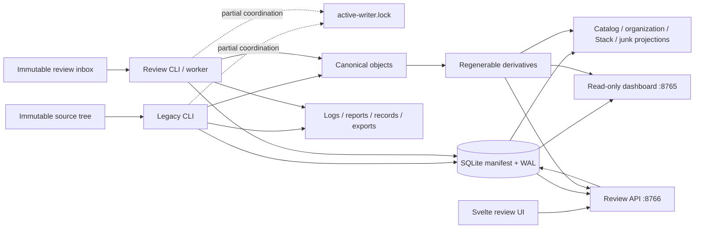
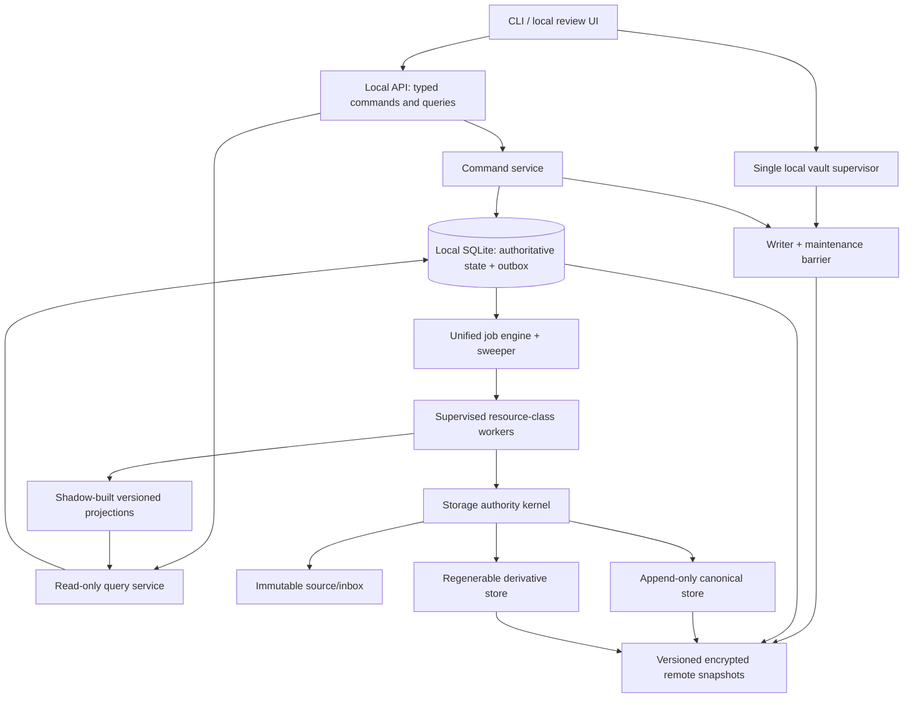

# Code, architecture, and operating-process review

Review date: 2026-07-22

Reviewed snapshot: `d49e621` on `codex/wip-review-interface-audit`

Release status: **safety hold — do not run this snapshot against the live source, vault, or inbox**

This document is the narrative review. The strictly ordered implementation register is in [ACTION_PRIORITY_MATRIX.md](ACTION_PRIORITY_MATRIX.md), the immediate stop conditions are in [SAFETY_HOLD.md](SAFETY_HOLD.md), and the evidence-producing activity log is in [REVIEW_WORKLOG_2026-07-22.md](REVIEW_WORKLOG_2026-07-22.md).

## Executive conclusion

The repository contains a thoughtful, unusually safety-conscious prototype with substantial synthetic test coverage. It has good local-only HTTP boundaries, a content-addressed object model, explicit approval concepts, persisted background work, a separate review application, and clear intent that originals and canonical objects are immutable.

It is nevertheless **not ready for live use**. Several independent defects can break the very invariants the design is intended to protect:

1. writer exclusion is neither race-free nor shared by all writers;
2. a corrupted or stale database path can escape the canonical-object root in legacy flows;
3. hard-link publication can leave a writable alias to a published canonical inode after a crash;
4. job claiming, leasing, heartbeats, retries, and recovery are implemented differently by stage and can strand work forever;
5. a successful reviewed copy does not reliably schedule the downstream work needed to make the photo appear in the prepared library;
6. the release-backfill launcher can process unrelated queued job kinds, including a reviewed copy;
7. the current backup/rebuild story cannot restore all review state and has not been proven by an independent restore drill;
8. several confirmation, selection, undo, caching, and pagination behaviours can apply stale intent or conceal incomplete results.

The recommended response is a **controlled architectural rework**, not a live rollout plus patches. Preserve the snapshot, freeze live mutation, create executable storage invariants, then move every workflow onto one durable job engine and one transactional outbox. SQLite remains a reasonable local authoritative store; a distributed database or cloud service is not required to solve the current problems.

## Scope and method

The review covered all application code, schema/migration code, CLI surfaces, both web applications, frontend source, scripts/configuration, tests, generated frontend bundle, and current operational documentation. It used:

- static inspection of every Python module and frontend route/component family;
- review of the complete staged diff from `409cf0d` to `d49e621`;
- focused audits of storage safety, API/UI behaviour, and operations/testing;
- execution of the existing synthetic test and static-check suites;
- dependency/advisory checks for runtime Python, production npm, and the full npm tree;
- CLI help inspection to reconcile documentation with the actual parser.

The review deliberately did **not**:

- open, decode, hash, compare, copy, or otherwise inspect real media;
- read from or write to `G:\photos`, `G:\MediaVault`, or `G:\MediaVaultImports`;
- take or inspect screenshots, browser video, or screenshot-bearing traces;
- exercise the software against production-sized or personally identifying data;
- apply a schema migration to the live vault;
- edit application code, tests, scripts, configuration, or generated assets.

Passing synthetic tests are evidence about covered behaviour, not a waiver for uncovered concurrency, crash, filesystem, restore, and human-factor risks.

## Current system map



The dotted lock edges are the central warning: the lock is not a universal transaction boundary. Review API mutations open writable SQLite connections without participating in it, and the lock itself has create/write and cross-host stale-owner defects.

## Component inventory and assessment

| Area | Main implementation | Responsibility | Assessment |
|---|---|---|---|
| CLI and orchestration | `media_vault/cli.py` | Command parsing, run lifecycle, tool resolution, legacy workflows, servers/workers | Clear entry points, but mutability/read-only classification and lock ownership are inconsistent; hidden atime overrides complicate operator expectations |
| Core safety utilities | `media_vault/core.py` | Hashes, byte comparison, layout, source separation, atime policy, logging, lock, atomic JSON | Good concentration of intent; lock and containment primitives are not strong enough for the claims placed on them |
| Manifest/schema | `media_vault/db.py` | Schema versions 1–12, migrations, connection wrapper | Rich persisted model; one very large schema/data-access module, weak domain constraints, and writable connection semantics leak into nominal readers |
| Explicit migration | `media_vault/migrations.py` | Backup, schema migration, validation, rollback | Correctly explicit in concept; coordination, space budget, publication/durability, and restore proof are incomplete |
| Discovery/metadata | `scanner.py`, `metadata.py` | Safe traversal intent, classification, ExifTool/FFprobe, full hashes, versions | Broad evidence model and no-follow intent; path/file identity needs handle-based revalidation and Windows root canonicalization |
| Legacy vault operations | `vault_ops.py` | Capacity, reports, canonical copy, validate, exports, reduced rebuild | Strong verification intent; unchecked database-derived paths, hard-link alias hazard, source-read bypasses, and incomplete recovery are release blockers |
| Relationship analysis | `relations.py` | Image/video relationships and RAW/JPEG grouping | Conservative exact/non-exact distinction; source fallback bypasses atime gate and deep-video subprocess handling can deadlock or overrun |
| Preprocessing | `preprocess.py`, `_decode_worker.py` | Derivatives, metadata, features, preview preparation | Correctly backgrounded and versioned; lease recovery/heartbeat semantics, decoder sandboxing, and persisted-input verification need unification |
| Review import model | `review_imports.py` | Inbox discovery, observations, rollups, decisions, prepared manifest | Good revision/evidence concepts; immutable-handle identity and transaction-bound workflow handoff need strengthening |
| Reviewed copy | `review_copy.py` | Approval, execute authorization, copy attempts, telemetry, pause/cancel | Good two-gate intent and rich evidence; hard-link publication, job recovery, shutdown, and downstream scheduling are unsafe/incomplete |
| Stage 6 orchestration | `review_stage6.py` | Manifest views, preflight, execute, inbox scan jobs | Stage-specific state machine can strand `running` jobs and duplicates generic job concerns |
| Catalog/library | `review_library.py` | Logical photos, facets, materialized library views | Useful projection model and bounded queries; invalidation and stable user-state lineage across merge/split are not reliable |
| Organization | `review_organization.py` | Calendar, folders, equipment, maps | Prepared offline views are appropriate; large rebuild transaction/visibility and frontend pagination/map semantics need work |
| Stacks | `review_stacks.py` | Feature inputs, candidates, profiles, grouping, cover ranking | Explainability and profiles are strengths; checksum trust, representative-corpus calibration, and generation lifecycle need strengthening |
| Junk review | `review_junk.py` | Signals, profiles, results, feedback/calibration | Metadata-only recommendation design is good; real-world calibration, durable action semantics, and lifecycle/retention remain incomplete |
| Release backfill | `review_backfill.py` | Low-priority coordinator, materialization sequence, release audit | Valuable orchestration prototype; inventory, retry accounting, scope isolation, audit read-only behaviour, and DR assertions are unsafe |
| Worker runtime | `review_runtime.py` | Dispatcher, worker loop, inbox scan, preprocessing/backfill launch | Small and understandable; single sequential loop, partial recovery, job-kind leakage, and unenforced configured limits are architectural gaps |
| Review API | `review_api.py` | `/api/v1`, security middleware, queries, mutations, static UI, embedded worker | Many good local security controls; 4,700+ lines, writable readers, GET side effects, body buffering, unstable caching, and weak domain separation |
| Legacy dashboard | `ui_server.py` | GET-only local dashboard and existing derivatives/cache | Meaningfully read-only at SQLite/HTTP level; hostname/DNS-rebinding and derivative realpath boundaries need hardening |
| Svelte frontend | `review_ui/src` | Imports, Library, Organize, Junk, Bulk reject, Settings | Broad functional prototype; stale confirmations/selections, polling races, incomplete cursors, unsafe shortcuts, accessibility and visible polish gaps |
| Frontend build | `review_ui/build` | Checked-in static production bundle | Reproducible bundle intent is useful; release identity/version provenance and generated-diff policy need formalization |
| Tests | `tests`, `review_ui/src/**/*.test.*`, Playwright | Synthetic invariants, API/domain behaviour, UI components, smoke/a11y | Strong breadth for a prototype; missing CI, coverage gates, crash/concurrency/disk-full/restore/populated-UI and production-scale evidence |
| Packaging/dependencies | `pyproject.toml`, lock files, `package*.json` | Python/npm installation and versions | Locked dependencies and clean current runtime audit; no clean wheel/sdist proof, SBOM policy, or honest prerelease versioning |
| Operator scripts/docs | `run.ps1`, resume launcher, Markdown | Local invocation and live-backfill guidance | Simple entry point; existing live-backfill guidance overstates safety and is quarantined by this review |

## Safety invariants: intended versus demonstrated

| Invariant | Intended design | Review result |
|---|---|---|
| Original media is immutable | Reads only; traversal does not follow reparse points | Content mutation is not part of normal flows, but some source reads bypass the centralized atime guard; handle identity is not revalidated end to end |
| Canonical objects are append-only and immutable | Triple hash, byte compare, no-overwrite publication | Existing objects are not intentionally overwritten, but a crash can leave a writable hard-link alias to the canonical inode; OS-level immutability is not enforced |
| One writer or maintenance operation at a time | `active-writer.lock` | False as a system-wide guarantee: lock creation is racy, host handling is unsafe, and API writers bypass it |
| Persisted paths cannot escape their authority root | Layout/separation checks and some lexical containment | False at all boundaries: legacy `object_relpath` is trusted, and derivative/open-folder boundaries do not uniformly enforce realpath/no-follow containment |
| HTTP requests do no media work | Serve prepared derivatives, mutate metadata, or enqueue jobs | Largely upheld and a major strength; GET-triggered job preparation should still become an explicit POST |
| Every accepted action is bound to current intent | optimistic revisions, approvals, idempotency | Backend foundations exist, but frontend confirmation booleans and selections can survive subject changes and failure paths can clear evidence |
| Every job is recoverable and bounded | durable rows, leases, heartbeats, pause/cancel | False across all job kinds: several stages recover differently; Stage 6 and lone expired jobs can remain `running` forever; retry accounting is inconsistent |
| A completed import reaches a visible library state | copy then preprocessing/materializations | False: reviewed-copy completion does not reliably enqueue preprocessing and invalidate/rebuild downstream projections |
| Backup can restore the application | migration backup, sidecars, exports | Not demonstrated: same-disk migration backup is not DR, sidecars are incomplete, and no application-consistent remote restore drill exists |
| Tests never touch live media or capture screens | temporary synthetic data; Playwright capture disabled | Demonstrated by the reviewed configuration and executed suites; keep repository/CI guards so this cannot regress |

## What is already worth preserving

The architecture should not be discarded wholesale. Preserve these decisions:

- exact file identity is separate from visual/decoded similarity;
- canonical object names are content-derived and format-neutral;
- publication is designed to be no-overwrite, with conflict evidence retained;
- source observations and versions are append-oriented rather than silently rewritten;
- include/exclude, favourite, reject, rating, cover, and feedback are metadata-only actions;
- review UI and legacy read-only dashboard are separate applications and ports;
- HTTP handlers serve existing prepared data or enqueue work rather than decoding/copying media;
- derivatives and materializations are visibly separate from originals/canonical objects and can be rebuilt;
- imports have separate review, approval, and execute-authorization concepts;
- background jobs, attempts, progress, events, and errors are persisted instead of existing only in memory;
- prepared views use generations so incomplete work can in principle remain invisible;
- map geometry and review assets are local, with no analytics/CDN/tile dependency;
- tests use isolated synthetic corpora and verify source/canonical hashes and filesystem metadata around risky operations;
- migrations are explicit rather than silently occurring on ordinary open.

The rework should turn these good intentions into enforced, composable invariants.

## Detailed findings by architectural layer

### 1. Storage authority and path handling

The current design mixes trusted `Path` values, database-relative paths, request parameters, and filesystem-resolved paths. Each module performs some of its own containment checking. Lexical containment is not sufficient on Windows when junctions/reparse points, case aliases, short names, mounted paths, or directory replacement can change what a path reaches.

Key failures:

- legacy import can use `destinations.object_relpath` without proving that the resolved target is below `objects`;
- relationship/validation code can fall back to a source path without the same read authorization used by scan/import;
- dashboard and derivative-serving checks do not all use one realpath/no-follow policy;
- open-in-folder crosses from database evidence into an OS process and needs its own authority capability;
- root identity can fragment across Windows spelling/case/alias variants;
- a file can change between `stat`, read, verification, and association unless one no-follow handle/identity is carried through the operation.

Required design: introduce one storage kernel with typed operations such as `SourceReader`, `InboxReader`, `CanonicalPublisher`, `DerivativeStore`, and `FolderOpener`. Callers pass stable IDs and expected evidence, not arbitrary filesystem paths. The kernel resolves and validates every path immediately before opening, refuses reparse traversal according to policy, opens with no-follow semantics where supported, checks device/file identity, and logs the authority decision.

Related actions: W02, W03, W14, W15, W37, W38, W55.

### 2. Writer exclusion, SQLite, and maintenance

`VaultRunLock` creates an empty file using exclusive create and then writes owner metadata. A contender can observe the incomplete file, treat it as invalid/stale, unlink it, and acquire its own lock while the first process continues. Stale-owner logic records a host but validates the PID on the current host, so a shared vault can clear another host's active lock. More importantly, review API mutations use writable SQLite transactions without the lock. Migration therefore cannot infer quiescence from the lock.

SQLite itself is appropriate for a single-machine local vault, provided the application makes the single-writer/maintenance contract real. A server database would add operational risk without automatically fixing path safety or canonical publication.

Required design:

- one local supervisor owns the writable manifest connection and mutation queue;
- CLI mutations either ask that service to execute a command or acquire the same OS-backed exclusive barrier while the service is stopped;
- maintenance mode refuses new mutations, drains/checkpoints at a safe boundary, proves no active workers, and then grants an exclusive token;
- lock records are atomically complete, host-aware, lease/heartbeat based where appropriate, and never broken merely because a same-numbered local PID is absent;
- normal query tools use URI `mode=ro`, `query_only=ON`, and cannot initialize schema or change journal settings;
- SQLite remains on a supported local filesystem; the remote server holds versioned backups, not the live WAL database.

Related actions: W01, W09, W20, W31.

### 3. Canonical publication and durability

The copy path writes and verifies a temporary file, then creates the final name with `os.link(temp, final)` and removes the temporary name. If the process crashes between those operations, the temporary and final names refer to the same inode. The temporary alias remains in a writable state directory; any later cleanup, repair, tool, or operator that opens it for writing changes the canonical object's bytes too. The current application also does not make canonical immutability an enforceable ACL/attribute contract.

This is not a reason to weaken verification. It is a reason to replace the publication primitive and explicitly define supported filesystems. The design needs a proven same-filesystem, atomic, no-replace transition that does not leave a mutable alias. On Windows this may require a platform-specific primitive and immediate permission/attribute hardening. On every supported platform, power-loss tests must cover file data, directory-entry durability, conflict evidence, and restart reconciliation.

Related actions: W02, W14, W15.

### 4. Jobs, leases, retries, and shutdown

There is a general `background_jobs` table, but each stage implements its own subset of:

- enqueue/deduplicate;
- claim;
- lease and heartbeat;
- attempt counting;
- failure and retry;
- stale-running recovery;
- progress/events;
- pause/resume/cancel;
- process shutdown.

This has created incompatible failure semantics. Stage 6 jobs can remain `running` indefinitely. Reviewed-copy and preprocessing recovery can be performed only inside claim paths, while the dispatcher searches only queued work, so a lone expired running job may never reach the recovery code. Preprocessing heartbeats do not consistently extend the lease. The embedded worker is a daemon thread, gets a five-second join, and cannot propagate cooperative shutdown into every runner.

Required design: one job engine with a small explicit state machine and one sweeper. A job claim and attempt row are created transactionally. A lease owner must heartbeat and extend the lease. The sweeper independently finds every expired `running` job, checks the job kind's recovery policy, and either requeues it with bounded attempt accounting or marks it terminal/manual-intervention. Pause and cancel are requests checked at documented safe boundaries. Web process shutdown is separate from worker supervision.

Suggested core states:

```text
queued -> running -> succeeded
   |         |  \-> paused
   |         |  \-> retry_wait -> queued
   |         |  \-> failed
   |         \----> cancelled_at_safe_boundary
   \--------------> cancelled_before_start
```

Every transition should be constrained in the schema and emitted as an append-only event.

Related actions: W04, W18, W19, W24, W25, W33, W40, W41, W54.

### 5. Import-to-library workflow integrity

Approval and execute authorization are useful, but the end-to-end workflow is not one transactionally connected graph. A reviewed-copy job can succeed without enqueueing asset preprocessing. Later catalog/organization/Stack/junk generations are not reliably invalidated. The application can therefore tell the operator that copy completed while the new photo is absent from the Library or served by stale projections.

Use a transactional outbox. In the same SQLite transaction that records a verified new asset/source association, append an immutable `AssetVerified` event with source revision, analyzer policy, and desired derivative profile. A dispatcher consumes that event idempotently and creates the dependent jobs. Each projection records exactly which source/catalog generation it represents.

Logical-photo IDs need explicit lineage. RAW/JPEG relationship changes can merge or split entities; favourite/reject/rating/cover state must not disappear or silently attach to the wrong new entity. Define deterministic rules and store merge/split events plus user-state provenance. Ambiguous state should be held for review rather than guessed.

Related actions: W05, W06, W16, W24, W35, W39, W41.

### 6. Backfill and release audit

The backfill coordinator pages live assets by `asset_id`; a concurrent lower-sorting insertion can fall behind the cursor and never be processed. Attempt count is incremented only on initial start in some paths, permitting unbounded retry. `preprocess --backfill` invokes the general worker with all supported kinds, so it can execute queued reviewed-copy work and publish canonical media even though the operator believes they launched derivative preparation only.

Backfill should create an immutable inventory for a named generation, then enqueue only its own typed child jobs. New imports belong to a later incremental generation/outbox and are not smuggled into the old inventory. The coordinator must never claim unrelated work. Every attempt increments once, all retry limits are finite, and terminal omissions are reported explicitly.

The current release audit is not a disaster-recovery audit. It uses the general manifest connection, can alter SQLite connection state, samples rather than proves some object truth, and cannot show that review state is restorable. Replace it with a read-only semantic audit plus a separate restore drill against an isolated snapshot.

Related actions: W06, W07, W16, W20, W26.

### 7. API boundary

The review API has many commendable controls: localhost-only host options, TrustedHost on the new app, same-origin mutation checks, JSON-only mutations, request/query budgets, idempotency keys, typed error envelopes, CSP, and no direct media processing in handlers.

The main problems are architectural concentration and semantic leakage:

- `review_api.py` is more than 4,700 lines and combines routing, SQL repositories, domain rules, response mapping, static serving, browser launch, security middleware, and worker lifecycle;
- request bodies can be buffered before the declared size is enforced, especially with chunked transfer;
- some GET paths enqueue preparation, violating safe/idempotent read expectations;
- nominal status/audit readers may use writable `ManifestDB` behaviour;
- stable derivative URLs are cached as public immutable for a year even though “current” content may change;
- API caps and cursor contracts are not always surfaced or consumed by the client;
- exception observability is too weak, while private paths/metadata require careful redaction;
- the legacy dashboard lacks equivalent TrustedHost protection, creating DNS-rebinding disclosure risk.

Split by domain only after the core invariants exist as tests. Keep cross-cutting security, transaction, idempotency, and envelope handling centralized. A useful boundary is route -> typed command/query -> domain service -> repository/storage capability. Generate or validate the frontend contract from the same schema.

Related actions: W13, W17, W18, W20, W21, W24, W25, W30, W31, W32, W42, W55.

### 8. Frontend decision safety and usability

The frontend is much more than a mock-up, but some state is local to components when it represents a durable safety decision:

- confirmation checkboxes can remain selected when batch, entity, profile, or selection changes;
- generic Library multi-reject bypasses the dedicated large-selection/favourite safeguards;
- selected items can remain hidden after filtering;
- parents may swallow action errors while children clear selection/history;
- bulk undo exists only in component memory, and Stack actions do not expose the same durable action identifier;
- global bare-letter F/X/I shortcuts can mutate state outside a deliberately focused grid;
- polling starts multiple requests every three seconds without consistent cancellation, deduplication, teardown, or latest-response-wins protection;
- Organization ignores some cursors, facets cover only an initial slice, and some detail collections are silently capped;
- Junk/Bulk flows have forward-only paging;
- shell density and generic saved-view settings are partly inert; update/delete operations are not fully surfaced;
- map controls change server filtering while the SVG remains a fixed world projection;
- scroll restoration is offset-based rather than anchored to the previously visible item;
- ARIA tab/inspector behaviours and variable-height virtualization need real populated-state tests;
- visible source includes mis-decoded punctuation/arrows and references an undefined theme token.

Treat every destructive-metadata confirmation as a value object bound to an exact target hash/revision, not a free-floating Boolean. The backend should return an action ID and resulting revision; the client clears state only after success and can reload durable undo history. All pages should display “showing N of total M”, consume cursors, and distinguish API health from worker/queue health.

Related actions: W10, W11, W12, W22, W23, W43–W50, W52, W57.

### 9. Performance and scale

The code already uses keyset paging and several materializations, which is preferable to sending the whole vault to the browser. However:

- some CLI/database paths still use `fetchall` or in-memory sorting;
- large catalog/organization builds can hold long transactions or expose expensive rebuild behaviour;
- configured worker resource limits are not implemented;
- repeated polling opens/query/closes on a fixed interval instead of using measured wakeup/backoff behaviour;
- generated data has no complete retention/compaction budget;
- Stack input trust can be based on derivative size/mtime rather than verified content identity;
- production-scale benchmarks are too narrow to predict full-vault rebuild and UI behaviour.

Keep a single sequential path for HDD-heavy source reads unless measurement proves parallelism helps. Resource classes should distinguish canonical/source I/O, media decoding, analysis CPU/memory, and SQLite projection work. Build large projections as invisible shadow generations in bounded transactions, validate them, then atomically advance the current-generation pointer.

Related actions: W23, W33, W34, W36, W39–W41, W46.

### 10. Backup, restore, privacy, and operations

Migration backup protects against some migration failures on the same storage. It is not a remote backup and does not establish a recovery point for source, objects, inbox, derivatives, WAL state, review decisions, or operational evidence. `rebuild-index` produces a reduced index from sidecars; it cannot recreate the schema-12 authoritative review application.

Operational state contains private paths, GPS, capture times, camera serials, review decisions, and error context. Backup and logging design must treat metadata as sensitive even when no image bytes are exposed.

The required operating model is in [MANUAL_REMOTE_BACKUP.md](MANUAL_REMOTE_BACKUP.md). Release should require a versioned encrypted remote snapshot and a restore to an isolated location that proves SQLite, objects, derivatives, projections, user state, and application queries. Add structured redacted logs, request/job correlation, worker health/lease age, backup age, queue depth, capacity alerts, and an operator sign-off record.

Related actions: W07, W16, W18, W26, W35, W41, W42, W52, W54, W56, W58.

### 11. Testing, release, and repository process

The current suite passed and is broad for a prototype. It includes synthetic source/canonical immutability checks, API security/optimistic state, import/worker behaviour, materializations, large indexed query fixtures, frontend unit/component tests, a smoke route test, and an automated accessibility pass. Capture is disabled.

The suite is not yet a release process. There is no repository CI, coverage threshold, clean package/build install, restore drill, crash matrix, disk-full/power-loss simulation, lock contention/cross-host model, populated end-to-end decision flow, or representative algorithm calibration. Version `1.0.0` overstates the maturity of the WIP. Formatting/type-checking policy is not consistently enforced, and the generated-bundle update/review rule is implicit.

Add CI guardrails that fail if media-like binaries are introduced into test fixtures, if tests resolve beneath configured live roots, or if Playwright capture is enabled. Store only synthetic fixture generators/small clearly artificial bytes. Record exact Git/build/tool identities in generated derivatives and backups. Build wheels/sdists and the frontend from clean environments, then install and exercise them before a release candidate is signed.

Related actions: W27–W29, W34, W50, W53, W56–W58.

## Recommended target architecture



### Boundary rules

1. Only the supervisor/command service owns writable manifest access during normal operation.
2. Queries use provably read-only connections and never enqueue work.
3. Every filesystem action is expressed through a typed storage capability.
4. HTTP handlers validate intent and enqueue commands; they never open media.
5. Every background activity uses the same job/attempt/lease/event engine.
6. Committing authoritative state and its outbox event is one SQLite transaction.
7. Workers are separate supervised processes, not daemon threads in the web server.
8. Derivatives/materializations are content/analyzer/generation addressed; “current” is a small validated pointer.
9. User metadata has explicit entity-lineage rules and durable undo/audit.
10. Maintenance/backup/restore are first-class modes that exclude writers and produce evidence.

## Proposed module boundaries

This is a destination, not a request for a big-bang rename. Move one tested seam at a time.

```text
media_vault/
  domain/
    assets.py                 immutable identities and source revisions
    imports.py                batch/review/approval domain
    review_state.py           favourite/reject/rating/undo/lineage
    jobs.py                   job and attempt state machine
    projections.py            generation contracts
  application/
    commands/                 typed use cases
    queries/                  side-effect-free use cases
    workflows/                import/backfill DAG definitions
  infrastructure/
    sqlite/
      connection.py           writer/read-only/maintenance modes
      repositories/           domain-specific persistence
      migrations/             small ordered schema units
    storage/
      authority.py            roots, containment, handles, identity
      canonical.py            publication, durability, conflicts
      derivatives.py          content/version-addressed outputs
    workers/
      engine.py               claim/lease/sweep/retry/pause/cancel
      supervisor.py           processes, shutdown, resource classes
    tools/                    bounded ExifTool/FFmpeg/decoder adapters
  interfaces/
    cli/
    review_api/
    dashboard/
```

Avoid moving code merely to match the tree. A module move is complete only when the new boundary owns its invariants and callers can no longer bypass them.

## End-to-end target workflow


Each arrow means a persisted, idempotent dependency — not an in-memory function call. A failure leaves the last completed node valid, exposes the exact blocked node/reason, and never repeats canonical publication blindly.

## Rework sequence and release gates

### Phase P0A — freeze and prove the storage kernel

Implement W01–W03, W14, and W15 first. Build synthetic adversarial tests for incomplete lock records, concurrent acquisition, foreign hosts, PID reuse, junction/reparse swaps, corrupted DB paths, conflict publication, crash at every publication boundary, and power loss. Do not connect the WIP to live paths.

Exit gate: a written invariant suite proves that no operation can modify an existing canonical inode, escape an authority root, or run concurrently with exclusive maintenance.

### Phase P0B — unify jobs and workflow handoff

Implement W04–W06 and W19. Migrate one job kind at a time behind compatibility adapters. Add the sweeper before relying on leases. Add transactional outbox events at verified asset association and immutable backfill inventories.

Exit gate: kill/restart tests at every job transition always reach a terminal or explicitly paused/manual state, attempts are bounded, and successful import deterministically reaches a current prepared catalog.

### Phase P0C — prove recovery and operator intent

Implement W07–W13 and W16. Establish remote snapshots and restore drills. Bind UI confirmations to exact revisions, route all bulk rejection through one domain command, make undo durable, and correct derivative caching.

Exit gate: restore a production-shaped synthetic vault (or a copied state whose live roots are OS-denied/unmounted and paths proven unreachable) to another location, pass the full semantic audit, then complete populated capture-disabled UI flows without stale-target actions.

### Phase P1 — harden service boundaries

Implement W17–W35. Separate worker/web processes, make readers read-only, stream request limits, modularize the API/schema, implement real resource limits, improve decoder isolation, package cleanly, and add CI/advisory policy.

Exit gate: CI is authoritative, clean artifacts install, security checks pass, and no public/documented capability exceeds measured behaviour.

### Phase P2/P3 — scale, accessibility, polish, and governance

Implement W36–W58 in matrix order unless evidence justifies a documented change. Benchmark first, then optimize. Complete pagination, accessibility, map/virtualization behaviour, status/doctor tooling, retention, privacy governance, support/security policy, and manual usability review.

Exit gate: named owner signs the release checklist, backup age and worker/schema health are visible, algorithm calibration is documented, and the live cutover has a tested rollback plan.

## Decisions to make explicitly

Record these as architecture decision records before implementation:

1. **Writer ownership:** single supervisor with RPC/command queue versus mutually exclusive short-lived CLI ownership. Recommendation: supervisor for normal review use, exclusive offline CLI maintenance mode.
2. **Canonical publication primitive:** supported Windows/filesystem-specific no-replace operation and immutable permission model. This must be proven experimentally, not selected from intuition.
3. **Protected-media atime policy:** verified no-update filesystem policy versus a storage snapshot/block method that does not open mounted files. Recommendation: prove one of those; do not promote the historical hidden CLI acknowledgement into a live CLI/HTTP/browser waiver.
4. **Entity lineage:** how favourite/reject/rating/cover state propagates on logical-photo merge/split. Recommendation: explicit lineage events with conservative ambiguity review.
5. **Backup consistency:** stopped snapshot versus coordinated online SQLite backup plus filesystem generation. Recommendation: stopped full snapshot first; add online support only after it can prove one generation.
6. **Generated frontend bundle:** commit it for simple Python packaging or build it in release CI. Either choice needs reproducible build identity and diff review.
7. **Supported filesystems/hosts:** local NTFS-only first versus cross-platform. Recommendation: name and test the narrow supported matrix before generalizing.
8. **Derivative retention/privacy:** retain all reviewed bytes versus regenerate aggressively. Recommendation: retain versioned review evidence until an audited policy allows pruning; encrypt and restrict it like the originals.

## Findings-to-action traceability

Every recommendation in this review maps to the 58-row matrix. The highest-level mapping is:

| Concern | Actions |
|---|---|
| Writer/maintenance exclusion | W01, W09, W20, W31 |
| Canonical/source/derivative path and publication safety | W02, W03, W08, W14, W15, W34, W37, W38, W55 |
| Job/recovery/workflow correctness | W04–W06, W18, W19, W24, W25, W33, W40, W41, W54 |
| Backup/recovery/audit | W07, W09, W16, W26, W35, W42, W52 |
| API/security/privacy | W13, W17, W20, W21, W29, W30–W32, W34, W42, W55 |
| Decision safety and frontend UX | W10–W12, W22–W25, W43–W52, W57 |
| Scale/performance | W05, W06, W23, W33, W36, W39–W41, W46 |
| Testing/release/maintainability | W27–W35, W50, W53, W56–W58 |

Use the stable W IDs in issues, commits, tests, ADRs, and release evidence. If an action is split, keep the parent ID and add suffixes such as `W04a`; do not silently drop the parent acceptance criteria.

## Final assessment

The repository is a valuable engineering prototype and is worth keeping. Its design is strongest where it separates immutable bytes from mutable review metadata and where it precomputes media-derived state outside HTTP requests. Its weakest point is that cross-cutting safety responsibilities are distributed among stages and entry points. That makes local correctness look stronger than system correctness.

The safest path is to make four things boring and universal: **one writer barrier, one path/storage authority, one canonical publication protocol, and one job engine**. Once those are executable invariants, the existing domain logic and much of the UI can be migrated incrementally. Until then, the WIP branch is documentation and implementation evidence only—not a live-vault tool.
